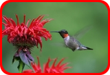

# Sketch [](https://github.com/reugn/sketch/actions/workflows/build.yml)

An image manipulation library for Kotlin.

`Sketch` doesn't require any external installation like OpenCV or OCR and can be used right away. It's actually a
zero-dependency library designed for simplicity that wraps the Java AWT BufferedImage. The library provides an
asynchronous interface for all image operations.

## Requirements

* Java 8+

## Installation

> The library is intended to be published to Maven Central.

In the meantime, it can be installed locally:

```sh
./gradlew publishToMavenLocal
```

Add the library as a dependency to your project:

```kotlin
dependencies {
    implementation("io.github.reugn:sketch:0.1.0")
}
```

## Features

Below is a list of the supported transformations/effects with the resulting image.  
Click the heading to get the test code that generated the example.

| Original Image |
|----------------|
||

### Transformations

| [Rotate][rotate] | [Resize][resize] | [Crop rectangle][crop] | [Crop circle][crop] |
|------------------|------------------|------------------------|---------------------|
|||||

[rotate]: src/test/kotlin/io/github/reugn/sketch/SketchRotateTest.kt

[resize]: src/test/kotlin/io/github/reugn/sketch/SketchResizeTest.kt

[crop]: src/test/kotlin/io/github/reugn/sketch/SketchCropTest.kt

| [Border radius][border] | [Add border][border] | [Add border with radius][border] |
|-------------------------|----------------------|----------------------------------|
||||

[border]: src/test/kotlin/io/github/reugn/sketch/SketchBorderTest.kt

| [Inline text][inline] | [Inline image][inline] | [Set pixels][pixels] |
|-----------------------|------------------------|----------------------|
||||

[inline]: src/test/kotlin/io/github/reugn/sketch/SketchInlineTest.kt

[pixels]: src/test/kotlin/io/github/reugn/sketch/SketchSetPixelsTest.kt

### Effects

| [Brightness][filter] | [Contrast][filter] | [Opacity][filter] |
|--------------------------|----------------------|--------------------|
||||

| [Color Mask][filter]  | [Grayscale][filter]  | [Invert Colors][filter] |
|-----------------------|----------------------|-------------------------|
||||

[filter]: src/test/kotlin/io/github/reugn/sketch/SketchFiltersTest.kt

| [Blur][blur] | [Blur partial][blur] |
|--------------|----------------------|
|||

[blur]: src/test/kotlin/io/github/reugn/sketch/SketchBlurTest.kt

| [Pixelate][pixelate] | [Pixelate partial][pixelate] |
|----------------------|------------------------------|
|||

[pixelate]: src/test/kotlin/io/github/reugn/sketch/SketchPixelateTest.kt

## License

Licensed under the [Apache 2.0 License](./LICENSE).
